# Neural Style Transfer
  The original repository can be found here : https://github.com/cysmith/neural-style-tf

## Breif Summary
This is a TensorFlow implementation of several techniques described in the papers: 
* [Image Style Transfer Using Convolutional Neural Networks](http://www.cv-foundation.org/openaccess/content_cvpr_2016/papers/Gatys_Image_Style_Transfer_CVPR_2016_paper.pdf)
by Leon A. Gatys, Alexander S. Ecker, Matthias Bethge
* [Artistic style transfer for videos](https://arxiv.org/abs/1604.08610)
by Manuel Ruder, Alexey Dosovitskiy, Thomas Brox
* [Preserving Color in Neural Artistic Style Transfer](https://arxiv.org/abs/1606.05897)
by Leon A. Gatys, Matthias Bethge, Aaron Hertzmann, Eli Shechtman  

Additionally, techniques are presented for semantic segmentation and multiple style transfer.

The Neural Style algorithm synthesizes a [pastiche](https://en.wikipedia.org/wiki/Pastiche) by separating and combining the content of one image with the style of another image using convolutional neural networks (CNN). Below are some examples and renders.

 

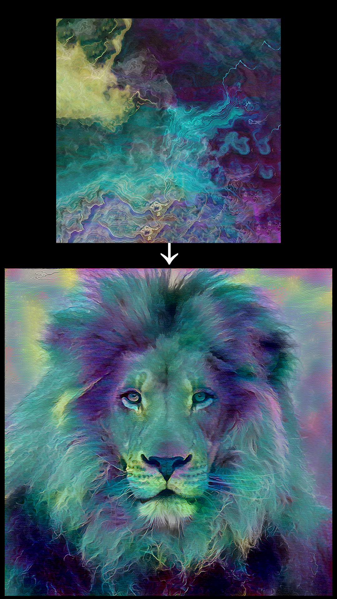
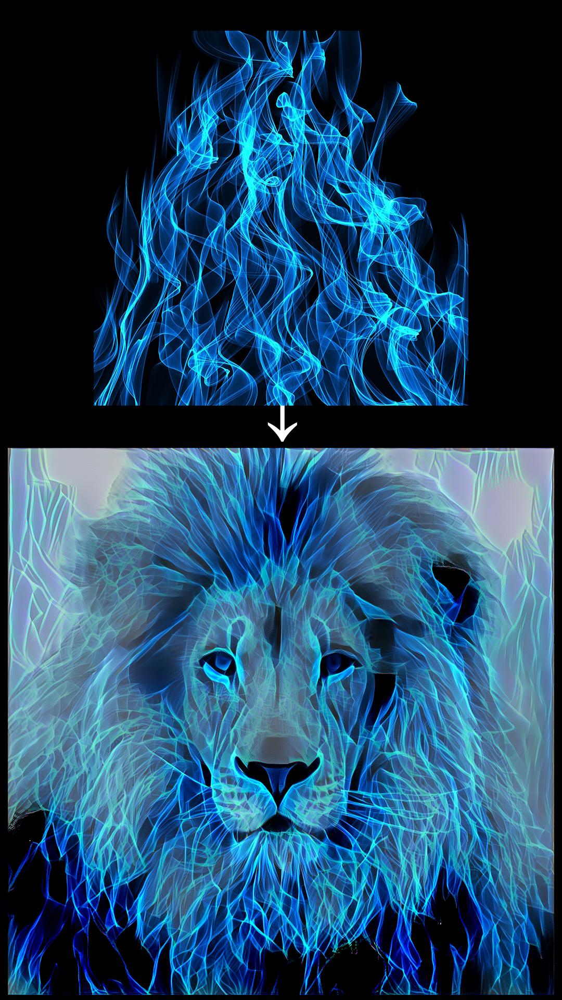
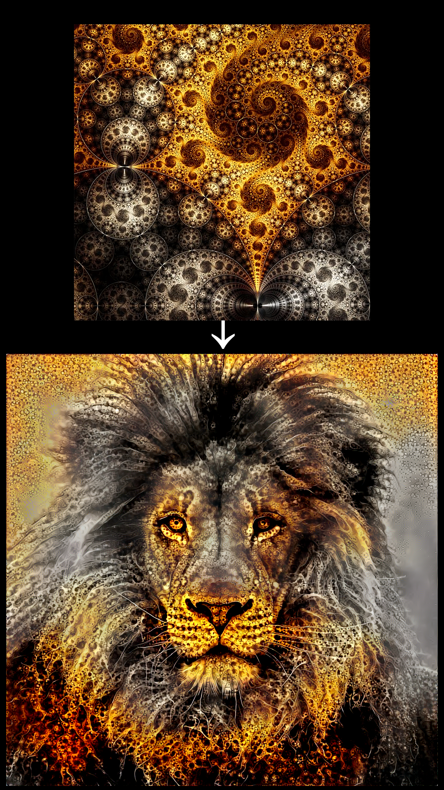
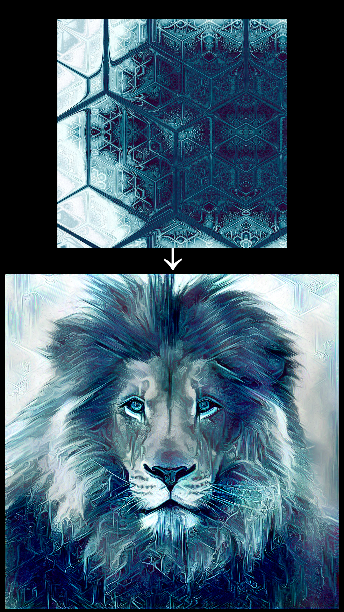
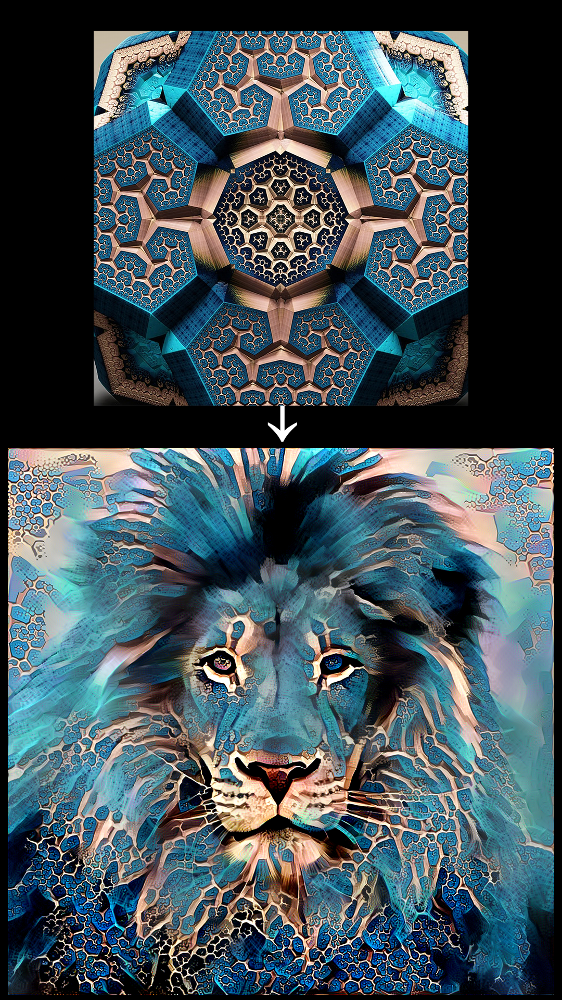
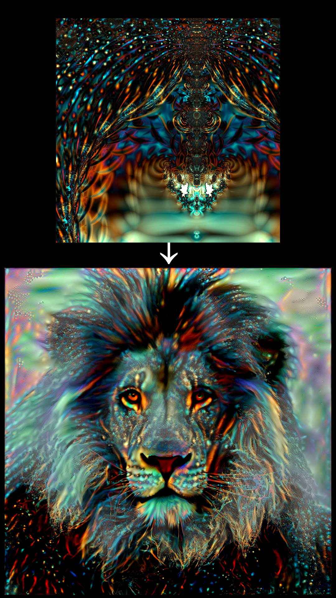
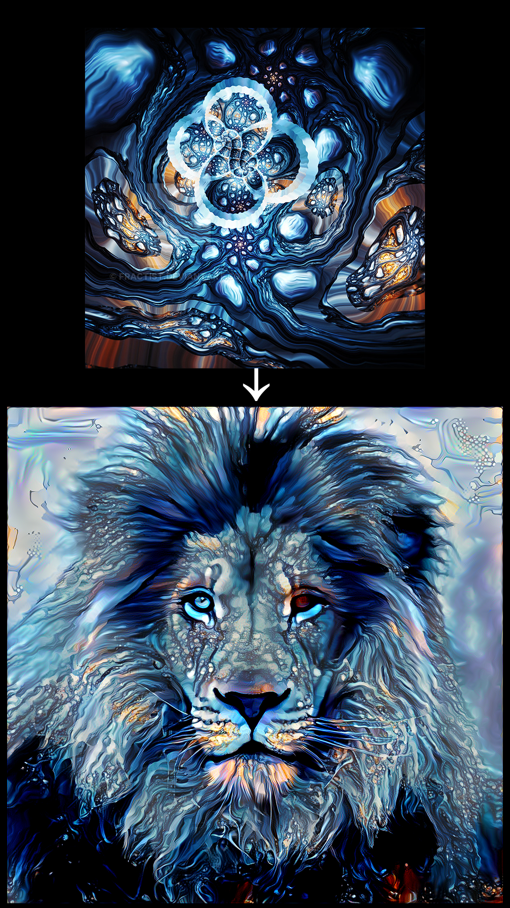
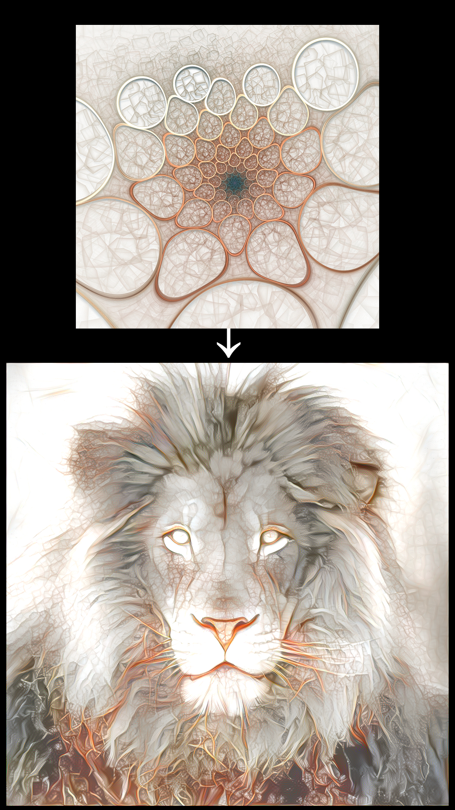
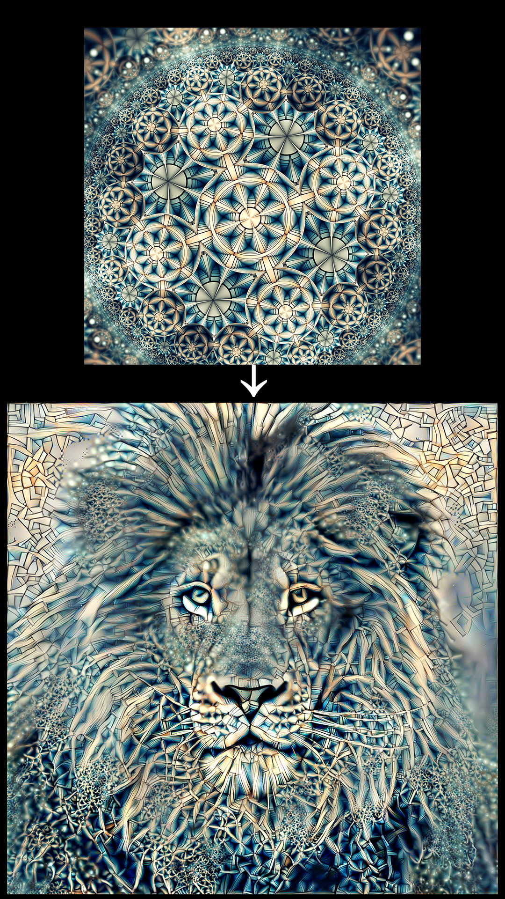
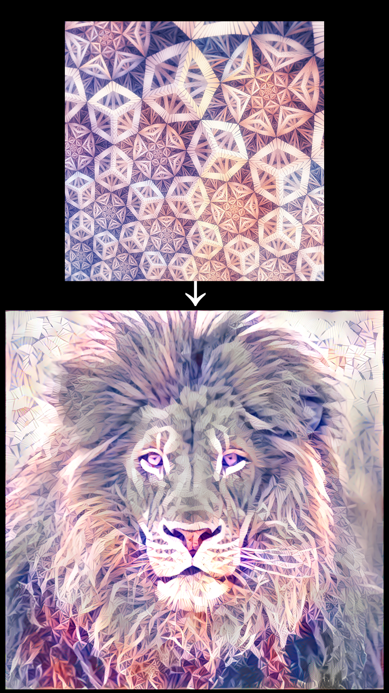
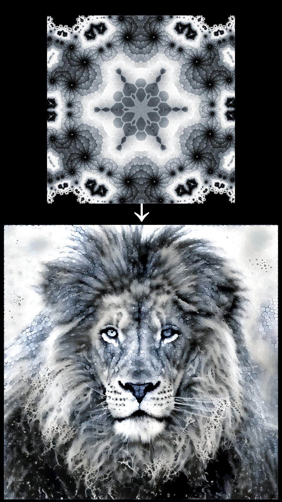

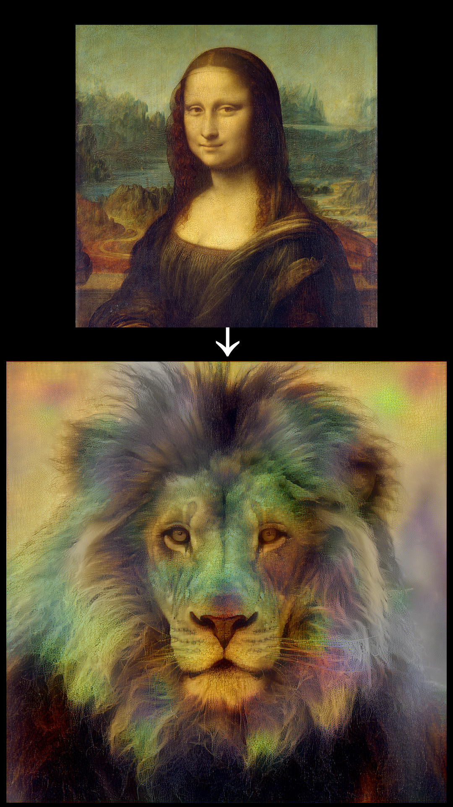
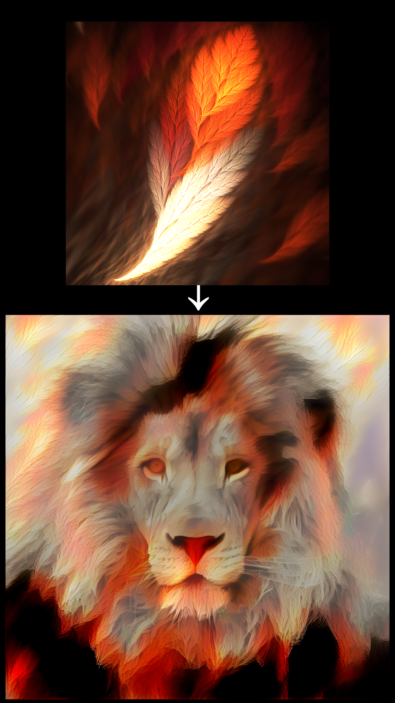
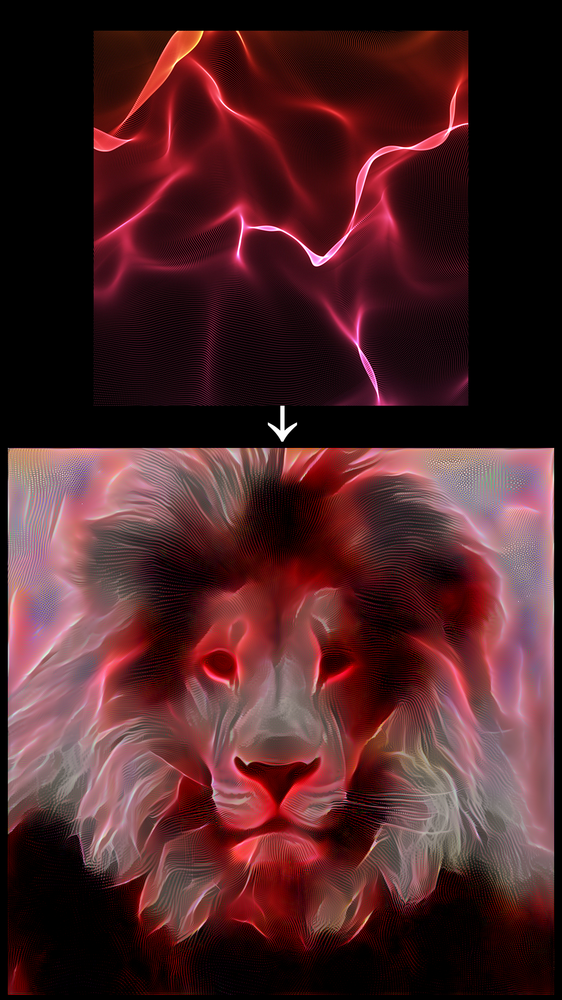

